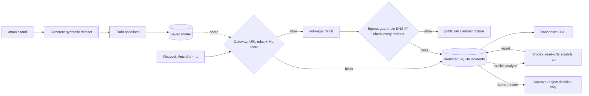

# ML Web Security Gateway (research POC)

A local, synthetic demonstration of SSRF prevention: an inbound rules + ML gateway forwards
requests to a containerised app; the app's egress guard pins validated DNS results and checks
every redirect. Blocked requests become redacted SQLite incidents. A headless Codex run can
propose a fix for human review; it never changes code automatically. Not a production WAF.

## Architecture



The egress guard is a **library inside `vuln-app`**, not a separate proxy or network firewall.
Only the gateway is published (`127.0.0.1:9100`). Metadata and internal services contain dummy
data; blocked destinations are not contacted. The deliberately unsafe `/unsafe-fetch` baseline
is accessible only from inside its container.

## Run

Requires [uv](https://docs.astral.sh/uv/) and Docker Compose.

```bash
uv sync
uv run mlwsg generate                 # synthetic dataset (artifacts/dataset.csv)
uv run mlwsg train                    # saved baselines + held-out metrics
uv run pytest                         # local checks
docker compose up --build -d          # isolated lab; only gateway published on loopback
curl -G --data-urlencode 'url=http://public.lab/ok' http://127.0.0.1:9100/fetch
curl -G --data-urlencode 'url=http://169.254.169.254/computeMetadata/v1/' http://127.0.0.1:9100/fetch
curl -G --data-urlencode 'url=http://redirect.attacker.lab/r?to=http://169.254.169.254/computeMetadata/v1/' http://127.0.0.1:9100/fetch
```

Open <http://127.0.0.1:9100/> to inspect incidents. `uv run mlwsg incidents` lists them;
`uv run mlwsg incident 1 show` displays one. To analyse one **explicitly**, install/authenticate
Codex on the host and run `uv run mlwsg incident 1 analyse`. Review its report, then record a
human decision with `uv run mlwsg incident 1 approve` or `reject`. Approval records a decision;
there is **no automatic patch application or deployment**.

The unguarded baseline is opt-in and reachable only inside `vuln-app`. To see a dummy token leak:

```bash
docker compose exec -T vuln-app uv run --no-sync python -c 'import httpx; print(httpx.get("http://127.0.0.1:8000/unsafe-fetch", params={"url":"http://169.254.169.254/computeMetadata/v1/instance/service-accounts/default/token"}).json())'
```

Stop with `docker compose down`. Delete `artifacts/` to reset local data. The lab uses only dummy
credentials and internal networks; do not point it at external systems.

## Next

See [CONTRIBUTING.md](CONTRIBUTING.md) for the code map and development commands,
[docs/threat_model.md](docs/threat_model.md) for the attack catalogue, and
[docs/handover.md](docs/handover.md) for the remaining evaluation and paper work.

The dataset and held-out metrics are synthetic, not evidence of real-traffic performance.
Some catalogue variants are threat-model cases rather than live Docker fixtures. MIT licensed.
