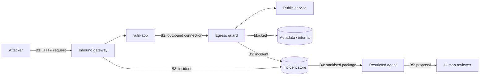

# Threat Model (Phase 1)

This document defines what the gateway protects, who attacks it and how. It informs the paper's
*Threat Model* section. Every catalogue attack becomes a synthetic dataset family; the Docker
POC exercises representative cases, not every catalogue technique live. The machine-readable
catalogue is `src/mlwsg/attacks.toml` (`uv run mlwsg attacks`).

## 1. System under study

A web application on a cloud VM exposes a feature that fetches a user-supplied URL (preview,
webhook, image import). The lab emulates the VM with Docker containers:

| Real cloud | Lab equivalent | Address |
|---|---|---|
| VM running the web app | `vuln-app` container | lab bridge network |
| Instance metadata service | `metadata-sim` container, dummy credentials | `169.254.169.254`, `fd00:ec2::254`, `metadata.google.internal` |
| Private VPC services | `internal-admin`, `internal-redis` | `10.10.0.10`, `10.10.0.11` |
| Attacker-controlled DNS and web | lab DNS zone `attacker.lab`, redirect server | resolved by the lab resolver only |

Containers share the host kernel, so the lab isolates the application layer, not the OS. The
metadata service is emulated from the documented GCP and AWS interfaces [2, 3]; it is not a real
hypervisor endpoint.

## 2. Assets

| Asset | Why it matters | Ranges treated as protected |
|---|---|---|
| `metadata` | Returns instance identity and short-lived service-account tokens [2, 3] | `169.254.169.254/32`, `fd00:ec2::254/128` |
| `internal` | Admin panels and data stores assume the private network is trusted | `10.10.0.0/24` |
| `loopback` | Services bound to the app container itself | `127.0.0.0/8`, `::1/128`, `0.0.0.0/32` |
| `filesystem` | Local files readable through non-HTTP schemes | n/a |
| Source code and logs | Given to the remediation agent; may contain secrets | n/a |

## 3. Adversary

* Remote and unauthenticated; controls the value of the vulnerable `url` parameter only.
* Controls the zone `attacker.lab` (arbitrary A/AAAA answers, short TTLs) and an HTTP server that
  returns arbitrary redirects.
* Knows common SSRF filter bypasses [1, 4] and may craft payloads to manipulate the agent [5].
* Has no shell, no credentials and no direct network path to internal services or metadata.

## 4. Trust boundaries

* **B1** Only the original request is visible; the final destination is not yet known.
* **B2** The resolved IP and every redirect hop are visible; this is where DNS and redirect
  attacks become observable.
* **B3/B4** Attacker-controlled strings cross into the analysis path and must be treated as data.
* **B5** No agent output reaches code without human approval.

## 5. Attack catalogue

22 techniques, grouped by vector. `layer` is the earliest boundary expected to stop the attack.

| Vector | IDs | Technique | Layer |
|---|---|---|---|
| `literal` | A01, A02, A16 | Plain metadata or private IPv4 | inbound + egress |
| `literal` | A04–A08, A13 | Alternative IPv4 forms: decimal, hex, octal, mixed radix, shortened, percent-encoded | inbound + egress |
| `literal` | A09–A12 | `0.0.0.0`, IPv6 loopback, IPv4-mapped IPv6, AWS IPv6 metadata | inbound + egress |
| `literal` | A14 | Userinfo confusion (`trusted@internal`) | inbound + egress |
| `parser` | A15 | Backslash parser differential [1] | inbound + egress |
| `dns` | A03, A17 | Hostname resolving to metadata or a private IP | inbound (A03) / egress |
| `dns` | A18 | DNS rebinding (time-of-check vs time-of-use) | egress |
| `redirect` | A19, A20 | Open redirect to metadata or internal service | egress |
| `scheme` | A21, A22 | `file://`, `gopher://` | inbound |

`dns` and `redirect` attacks carry no suspicious address in the request, which is why an
inbound-only filter is insufficient and the egress guard exists. The tests in
`tests/test_catalogue.py` check that each literal payload really reaches its declared address
under libc parsing and that each indirect payload hides it.

### Agent-path threats

| ID | Threat | Control |
|---|---|---|
| G01 | Indirect prompt injection through logged payloads [5] | Payloads quoted as data, fixed output schema |
| G02 | Secret leakage to the agent provider | Redaction before packaging, dummy credentials only |
| G03 | Incorrect or malicious patch | Human approval and isolated retest |
| G04 | Agent tool misuse or sandbox escape | Read-only mount, no network, time limit |

## 6. Security goals and metrics

| Goal | Metric reported in the paper |
|---|---|
| Block every catalogue attack | Per-technique detection rate, recall |
| Keep benign traffic flowing | False-positive rate, precision |
| Generalise beyond known payloads | Recall on held-out technique families |
| Add little delay | p50/p95 added latency per request |
| Useful, safe remediation | Correct root cause, patch fixes attack, tests pass, human approval rate |

## 7. Out of scope

Denial of service, host or kernel compromise, container escape by the application, authenticated
attackers, blind SSRF timing channels, real cloud accounts and any system outside the lab.

## References

1. OWASP, *Server-Side Request Forgery Prevention Cheat Sheet*.
   <https://cheatsheetseries.owasp.org/cheatsheets/Server_Side_Request_Forgery_Prevention_Cheat_Sheet.html>
2. Google Cloud, *View and query VM metadata*.
   <https://docs.cloud.google.com/compute/docs/metadata/querying-metadata>
3. AWS, *Use the Instance Metadata Service to access instance metadata*.
   <https://docs.aws.amazon.com/AWSEC2/latest/UserGuide/configuring-instance-metadata-service.html>
4. O. Tsai, *A New Era of SSRF: Exploiting URL Parser in Trending Programming Languages*,
   Black Hat USA 2017.
5. OWASP, *LLM Prompt Injection Prevention Cheat Sheet*.
   <https://cheatsheetseries.owasp.org/cheatsheets/LLM_Prompt_Injection_Prevention_Cheat_Sheet.html>

Online sources accessed 27 September 2026.
